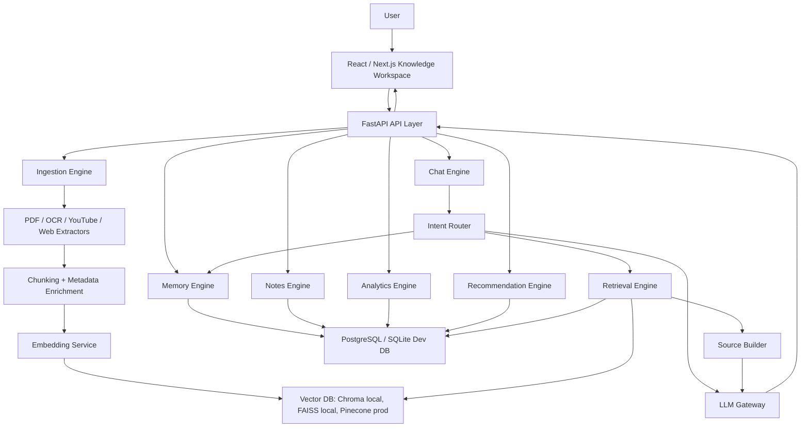

# Second Brain AI Production Blueprint

This app already has the right foundations: FastAPI, React/Vite, SQLite persistence, upload routes, OCR/PDF/YouTube ingestion, RAG services, graph services, analytics, flashcards, and a modern dashboard shell. The next upgrade should make those pieces more product-grade, modular, personalized, and scalable.

## 1. Target Product Architecture



### Recommended Stack

- Frontend: keep React/Vite for speed, or move to Next.js when you need auth, server components, route-level SEO, and production deployment polish.
- Backend: keep FastAPI. It is already the correct choice for AI ingestion, async jobs, and Python ML tooling.
- Storage: SQLite for local demo, PostgreSQL for production.
- Vector DB: Chroma for local MVP, FAISS for offline demo, Pinecone for hosted scale.
- LLM: OpenAI for best production quality, Groq for fast inexpensive demos, Claude for long-document reasoning.
- Background jobs: Celery/RQ + Redis, or FastAPI BackgroundTasks for a small MVP.
- Auth: Clerk/Auth.js/Supabase Auth for frontend identity, JWT passed to FastAPI.

## 2. Production Folder Structure

```text
SecondBrain/
  backend/
    app/
      main.py
      core/
        config.py
        security.py
        logging.py
      api/
        routes/
          chat.py
          memory.py
          notes.py
          documents.py
          retrieval.py
          recommendations.py
          analytics.py
      engines/
        chat_engine.py
        memory_engine.py
        retrieval_engine.py
        ingestion_engine.py
        recommendation_engine.py
        personalization_engine.py
      services/
        llm_gateway.py
        embedding_service.py
        vector_store.py
        document_extractors.py
        source_builder.py
      db/
        session.py
        models.py
        migrations/
      schemas/
        chat.py
        notes.py
        documents.py
    tests/
      test_memory.py
      test_rag.py
      test_ingestion.py
    requirements.txt

  Frontend/
    src/
      app/
      components/
        layout/
        chat/
        notes/
        uploads/
        dashboard/
        graph/
      hooks/
        useChat.js
        useDocuments.js
        useMemory.js
      lib/
        api.js
        session.js
      styles/
```

You do not need to migrate everything immediately. Start by moving the current `services/*` files into engine boundaries gradually.

## 3. Core Data Model

Minimum production entities:

```text
users
  id, email, display_name, created_at

conversations
  id, user_id, title, summary, created_at, updated_at

messages
  id, conversation_id, user_id, role, content, intent, created_at

memories
  id, user_id, type, content, importance, tags_json, source_message_id, created_at

notes
  id, user_id, title, body, tags_json, topic, parent_id, created_at, updated_at

documents
  id, user_id, source_type, title, source_ref, content, topic, status, created_at

chunks
  id, user_id, document_id, chunk_index, chunk_text, embedding_id, metadata_json, created_at

note_links
  id, user_id, source_note_id, target_note_id, relation_type

activity_events
  id, user_id, event_type, entity_type, entity_id, metadata_json, created_at

recommendations
  id, user_id, title, reason, action_prompt, status, created_at
```

## 4. Implementation Plan

### Phase 1: Make Memory Real

1. Split chat history from durable memory.
2. Add explicit memory commands: `remember this`, `forget this`, `what did I learn yesterday?`.
3. Store important facts in `memories`, not only in `chat_history`.
4. Embed each memory so semantic search can recall it.
5. Add memory source labels in assistant responses.

Acceptance criteria:

- A user can say `remember this: I am preparing for DSA interviews`.
- Later, `what am I preparing for?` retrieves that memory.
- The assistant distinguishes recent chat context from durable saved memory.

### Phase 2: Upgrade RAG Quality

1. Replace SQLite linear vector search with a vector abstraction that supports Chroma, FAISS, and Pinecone.
2. Add chunk metadata: page number, source URL, heading, timestamp for YouTube, token count.
3. Use hybrid retrieval: vector similarity + keyword overlap + recency/importance boost.
4. Add strict mode: answer only from user sources, otherwise say no source found.
5. Return citations to the UI with title, chunk, page/timestamp, and confidence.

Acceptance criteria:

- User can upload a PDF and ask: `answer strictly from this PDF`.
- Assistant answers with source chips.
- If the PDF does not contain the answer, assistant refuses gracefully.

### Phase 3: Notes And Knowledge Organization

1. Add `/api/notes` CRUD.
2. Add tags and topic grouping.
3. Auto-create note suggestions from chats/uploads.
4. Extract entities/concepts and create graph edges.
5. Add backlinks: "related notes" and "related sources".

Acceptance criteria:

- User can save any answer as a note.
- Notes have tags like `DSA`, `AI`, `ML`, `Projects`.
- Opening a note shows related notes and sources.

### Phase 4: Proactive Intelligence

1. Track activity events: uploads, questions, topics, flashcard reviews.
2. Generate daily recommendations from recent behavior.
3. Add cards in the dashboard: "Revise DSA today", "Summarize uploaded PDF", "Generate quiz".
4. Use spaced repetition data to prioritize weak topics.

Acceptance criteria:

- Dashboard shows 3 useful next actions.
- Recommendations explain why they appear.
- Clicking a recommendation runs the right assistant prompt.

### Phase 5: Product UI

1. Replace scroll-anchor navigation with real app sections/routes: Chats, Notes, Uploads, Dashboard, Graph.
2. Add a Notion-like notes panel with list, editor, tags, backlinks.
3. Add source drawer for citations.
4. Add activity timeline.
5. Make dark/light mode persistent.

Acceptance criteria:

- First screen feels like a knowledge workspace, not a chatbot.
- Users can navigate without losing chat state.
- Notes, uploads, and dashboard feel like first-class product areas.

### Phase 6: Production Readiness

1. Add auth and per-user isolation.
2. Add background ingestion jobs with status polling.
3. Add tests for memory, retrieval, source-grounding, upload failure cases.
4. Add observability: structured logs, request IDs, ingestion metrics.
5. Add deployment configs: Vercel frontend, Render/Railway backend, managed Postgres, hosted vector DB.

## 5. Key Code Snippets

### Memory Engine

```python
# backend/app/engines/memory_engine.py
from dataclasses import dataclass
from datetime import datetime, timedelta

from app.services.embedding_service import embed_text
from app.services.vector_store import VectorStore
from app.db.session import db


@dataclass
class MemoryCandidate:
    content: str
    type: str = "fact"
    importance: float = 0.6
    tags: list[str] | None = None


class MemoryEngine:
    def __init__(self, vector_store: VectorStore):
        self.vector_store = vector_store

    def should_store(self, text: str) -> bool:
        lowered = text.lower()
        return lowered.startswith("remember this") or "important for me" in lowered

    def normalize_memory(self, text: str) -> MemoryCandidate:
        content = text.replace("remember this:", "").replace("remember this", "").strip()
        return MemoryCandidate(content=content, tags=self._infer_tags(content))

    def save_memory(self, user_id: str, candidate: MemoryCandidate) -> dict:
        embedding = embed_text(candidate.content)
        memory = db.memories.create(
            user_id=user_id,
            type=candidate.type,
            content=candidate.content,
            importance=candidate.importance,
            tags_json=candidate.tags or [],
        )
        self.vector_store.upsert(
            namespace=f"user:{user_id}:memories",
            id=f"memory:{memory.id}",
            vector=embedding,
            metadata={"memory_id": memory.id, "type": candidate.type},
            text=candidate.content,
        )
        return {"id": memory.id, "content": memory.content}

    def recall(self, user_id: str, query: str, limit: int = 5) -> list[dict]:
        query_vector = embed_text(query)
        return self.vector_store.search(
            namespace=f"user:{user_id}:memories",
            vector=query_vector,
            limit=limit,
        )

    def learned_yesterday(self, user_id: str) -> list[dict]:
        end = datetime.utcnow().date()
        start = end - timedelta(days=1)
        return db.memories.find_between(user_id=user_id, start=start, end=end)

    def _infer_tags(self, text: str) -> list[str]:
        tags = []
        lowered = text.lower()
        for tag in ["dsa", "ai", "ml", "backend", "frontend", "system design"]:
            if tag in lowered:
                tags.append(tag.upper() if tag in {"dsa", "ai", "ml"} else tag)
        return tags or ["General"]
```

### RAG Pipeline

```python
# backend/app/engines/retrieval_engine.py
from app.services.embedding_service import embed_text
from app.services.vector_store import VectorStore
from app.services.source_builder import build_source_cards


class RetrievalEngine:
    def __init__(self, vector_store: VectorStore):
        self.vector_store = vector_store

    def retrieve(
        self,
        *,
        user_id: str,
        question: str,
        document_id: int | None = None,
        topic: str | None = None,
        strict: bool = False,
        limit: int = 8,
    ) -> dict:
        query_vector = embed_text(question)
        filters = {"user_id": user_id}
        if document_id:
            filters["document_id"] = document_id
        if topic:
            filters["topic"] = topic

        results = self.vector_store.search(
            namespace=f"user:{user_id}:knowledge",
            vector=query_vector,
            filters=filters,
            limit=limit * 2,
        )

        ranked = self._rerank(question, results)[:limit]
        if strict and not self._has_confident_match(ranked):
            return {"context": [], "sources": [], "strict_miss": True}

        return {
            "context": [self._format_chunk(item) for item in ranked],
            "sources": build_source_cards(ranked),
            "strict_miss": False,
        }

    def _rerank(self, question: str, results: list[dict]) -> list[dict]:
        question_terms = set(question.lower().split())
        for item in results:
            chunk_terms = set(item.get("text", "").lower().split())
            lexical = len(question_terms & chunk_terms) / max(len(question_terms), 1)
            item["final_score"] = (item["score"] * 0.75) + (lexical * 0.25)
        return sorted(results, key=lambda row: row["final_score"], reverse=True)

    def _has_confident_match(self, ranked: list[dict]) -> bool:
        return bool(ranked and ranked[0].get("final_score", 0) >= 0.35)

    def _format_chunk(self, item: dict) -> str:
        meta = item.get("metadata", {})
        return (
            f"Source: {meta.get('title', 'Untitled')}\n"
            f"Location: page {meta.get('page', 'unknown')}, chunk {meta.get('chunk_index', 0)}\n"
            f"Content: {item.get('text', '')}"
        )
```

### Chat Integration

```python
# backend/app/engines/chat_engine.py
from app.engines.memory_engine import MemoryEngine
from app.engines.retrieval_engine import RetrievalEngine
from app.engines.recommendation_engine import RecommendationEngine
from app.services.llm_gateway import complete


class ChatEngine:
    def __init__(
        self,
        memory: MemoryEngine,
        retrieval: RetrievalEngine,
        recommendations: RecommendationEngine,
    ):
        self.memory = memory
        self.retrieval = retrieval
        self.recommendations = recommendations

    def answer(self, *, user_id: str, message: str, strict: bool = False, document_id: int | None = None) -> dict:
        if self.memory.should_store(message):
            candidate = self.memory.normalize_memory(message)
            saved = self.memory.save_memory(user_id, candidate)
            return {
                "answer": f"Saved to memory: {saved['content']}",
                "sources": [],
                "actions": self.recommendations.next_actions(user_id),
            }

        recalled_memories = self.memory.recall(user_id, message, limit=4)
        retrieved = self.retrieval.retrieve(
            user_id=user_id,
            question=message,
            document_id=document_id,
            strict=strict,
        )

        if retrieved["strict_miss"]:
            return {
                "answer": "I could not find this in your saved knowledge sources.",
                "sources": [],
                "actions": self.recommendations.next_actions(user_id),
            }

        prompt = f"""
You are a personal Second Brain assistant.
Use saved memories for personalization.
Use source context for factual answers.
If strict mode is enabled, only answer from source context.

Saved memories:
{recalled_memories}

Source context:
{retrieved["context"]}

User question:
{message}

Return:
- direct answer
- explanation
- useful next step
- cite sources when source context was used
"""
        answer = complete(prompt, temperature=0.2)

        return {
            "answer": answer,
            "sources": retrieved["sources"],
            "actions": self.recommendations.next_actions(user_id),
        }
```

### Ingestion Pipeline

```python
# backend/app/engines/ingestion_engine.py
from app.services.document_extractors import extract_pdf_text, extract_youtube_transcript
from app.services.embedding_service import embed_many
from app.services.text_splitter import chunk_text
from app.services.vector_store import VectorStore
from app.db.session import db


class IngestionEngine:
    def __init__(self, vector_store: VectorStore):
        self.vector_store = vector_store

    def ingest_pdf(self, *, user_id: str, file_bytes: bytes, filename: str) -> dict:
        text, pages = extract_pdf_text(file_bytes)
        chunks = chunk_text(text, chunk_size=900, overlap=140)
        embeddings = embed_many([chunk.text for chunk in chunks])

        document = db.documents.create(
            user_id=user_id,
            source_type="pdf",
            title=filename,
            content=text,
            status="indexed",
        )

        vectors = []
        for index, chunk in enumerate(chunks):
            row = db.chunks.create(
                user_id=user_id,
                document_id=document.id,
                chunk_index=index,
                chunk_text=chunk.text,
                metadata_json={"page": chunk.page, "title": filename},
            )
            vectors.append({
                "id": f"chunk:{row.id}",
                "vector": embeddings[index],
                "text": chunk.text,
                "metadata": {
                    "chunk_id": row.id,
                    "document_id": document.id,
                    "title": filename,
                    "page": chunk.page,
                    "chunk_index": index,
                    "user_id": user_id,
                },
            })

        self.vector_store.upsert_many(namespace=f"user:{user_id}:knowledge", vectors=vectors)
        return {"document_id": document.id, "chunks": len(chunks), "status": "indexed"}
```

## 6. API Design

```text
POST   /api/chat
GET    /api/chats
GET    /api/chats/{conversation_id}
POST   /api/memory
GET    /api/memory/search?q=
DELETE /api/memory/{memory_id}
POST   /api/documents/upload
POST   /api/documents/youtube
GET    /api/documents
GET    /api/documents/{document_id}/chunks
POST   /api/notes
GET    /api/notes
PATCH  /api/notes/{note_id}
POST   /api/notes/{note_id}/link
GET    /api/recommendations
POST   /api/recommendations/{id}/dismiss
GET    /api/activity
GET    /api/graph
```

## 7. UI/UX Upgrade

Primary screens:

- Dashboard: today's focus, recent activity, weak topics, active sources, recommendations.
- Chat: source-grounded assistant, strict/source mode toggle, citation drawer.
- Notes: Notion-like note list, editor, tags, backlinks, related source chips.
- Uploads: PDF, image, YouTube, web link, ingestion status, failed extraction warnings.
- Graph: concept graph, related notes, source-backed concept explanations.
- Study: flashcards, revision plan, quizzes, progress streaks.

Important UX details:

- Keep chat state persistent per conversation.
- Show clear ingestion states: uploaded, extracting, chunking, embedding, indexed, failed.
- Every answer that uses RAG should show sources.
- Strict mode should be visually obvious.
- Recommendations should always include a reason and one-click action.

## 8. Internship-Level Standout Features

- Source-grounded strict mode with refusal when context is missing.
- Personal memory commands with semantic recall.
- Knowledge graph with clickable concepts and backlinks.
- Proactive daily study planner based on recent activity and weak topics.
- Spaced repetition flashcards generated from uploaded content.
- YouTube transcript ingestion with timestamp citations.
- Activity timeline: "Uploaded PDF", "Asked 8 DSA questions", "Reviewed 5 cards".
- Multi-model provider switch: OpenAI/Groq/Claude behind one LLM gateway.
- Evaluation suite: test retrieval precision, citation quality, hallucination refusal.
- Deployment story: Vercel + FastAPI + Postgres + Pinecone/Chroma.

## 9. Immediate Next Moves For This Repo

1. Keep your current FastAPI backend and React dashboard.
2. Add durable `memories`, `notes`, `activity_events`, and `recommendations` tables.
3. Refactor `services/rag_service.py` into `chat_engine.py`, `retrieval_engine.py`, and `memory_engine.py`.
4. Replace in-memory `topic_flow = {}` with persisted learning sessions.
5. Add strict source mode to `/api/ask`.
6. Add Notes page in the frontend.
7. Add recommendation cards backed by a real `/api/recommendations` route.
8. Add tests around memory recall, upload ingestion, strict RAG, and citation output.

